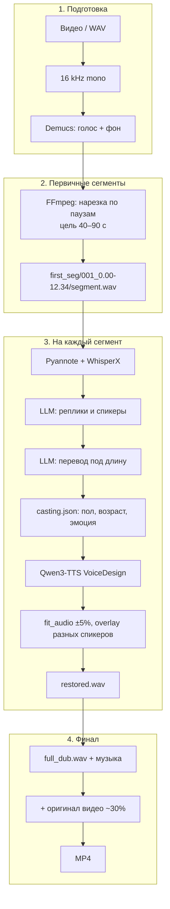

# SpeechLab

**Закадровый многоголосый дубляж видео** — перевод диалога, разметка спикеров, озвучка отдельным слоём и сборка финального ролика.

> Не lip-sync и не клонирование голоса актёра. Цель — понятный закадровый дубляж с профилем персонажа (пол, возраст, эмоция), а не копия оригинальной речи в кадре.

Спецификация продукта: [`PRD.md`](PRD.md)

---

## Пайплайн



| Этап | Инструменты |
|------|----------------|
| Аудио из видео | FFmpeg |
| Разделение голос / фон | [Demucs](https://github.com/facebookresearch/demucs) |
| Диаризация + ASR | [pyannote.audio](https://github.com/pyannote/pyannote-audio), [WhisperX](https://github.com/m-bain/whisperX) |
| Разметка и перевод | LLM (OpenAI-compatible API) |
| Биометрия / эмоция | wav2vec2 ([age/gender](https://huggingface.co/audeering/wav2vec2-large-robust-24-ft-age-gender), [emotion](https://huggingface.co/Dpngtm/wav2vec2-emotion-recognition)) |
| Озвучка | [Qwen3-TTS VoiceDesign](https://huggingface.co/Qwen/Qwen3-TTS-12Hz-1.7B-VoiceDesign) |
| Таймлайн | `fit_audio.py` (±5%, overlay только у разных спикеров) |

---

## Быстрый старт

### Требования

- Python 3.10+
- **FFmpeg** в `PATH`
- GPU рекомендуется (CUDA): WhisperX, Demucs, TTS
- Токен Hugging Face с доступом к `pyannote/speaker-diarization-community-1`
- Ключ LLM для разметки и перевода

### Установка

```bash
git clone https://github.com/HalooMo/Speech.git
cd Speech
python -m venv .venv
.venv\Scripts\activate          # Windows
# source .venv/bin/activate     # Linux / macOS
pip install -r requirements.txt
```

Скопируйте шаблон секретов и заполните **локально** (файл `.env` в git не попадает):

```bash
copy .env.example .env          # Windows
# cp .env.example .env          # Linux / macOS
```

| Переменная | Назначение |
|------------|------------|
| `HF_TOKEN` | Hugging Face (pyannote, модели) |
| `OPENAI_API_KEY` | LLM: сегментация + перевод |
| `OPENAI_BASE_URL` | Базовый URL API (по умолчанию в `env_config.py`) |
| `OPENAI_MODEL` | Модель чата |

### Запуск

```bash
python main.py <имя_проекта> <путь_к_видео> <язык_источника> <язык_дубляжа>
```

Пример:

```bash
python main.py myfilm diolog.mp4 en ru
```

Результат:

```text
myfilm/
  vocals.wav
  demucs_stems/
  first_seg/
  full_dub.wav
  final_mux_audio.wav
  dub_output_path.txt
  first_seg/.../second_seg/casting.json
  myfilm_dubbed.mp4
```

Тест вторичной разметки (PRD п. 3.1–3.2) — в начале `test.py` задайте `WAV_PATH`:

```bash
python test.py
```

---

## Структура репозитория

```text
Speech/
├── main.py              # оркестратор E2E
├── test.py              # diarization → WhisperX → LLM → нарезка
├── prompt.py            # промпты LLM
├── llm.py               # клиент API
├── get_param.py         # пол, возраст, эмоция по WAV
├── dubbing.py           # Qwen3-TTS
├── fit_audio.py         # подгонка длины и таймлайн
├── env_config.py        # загрузка .env
├── kaggle_one_cell.py   # один ноутбук на Kaggle
├── kaggle/              # инструкция для Kaggle
├── PRD.md               # требования (источник истины)
└── .cursor/rules/
    └── main-rules.mdc   # правила для агента в Cursor
```

---

## Kaggle

Полный прогон в одной ячейке: скопируйте [`kaggle_one_cell.py`](kaggle_one_cell.py) в GPU-ноутбук.

Подробности: [`kaggle/README.md`](kaggle/README.md)

- Dataset с кодом + видео
- Secrets: `HF_TOKEN`, `OPENAI_API_KEY`
- В ячейке оставьте плейсхолдеры `hf_...` / `sk-...` или задайте ключи только в Secrets

Зависимости для ноутбука: `requirements-kaggle.txt`

---

## Переменные окружения (опционально)

| Переменная | По умолчанию | Описание |
|------------|--------------|----------|
| `SPEECHLAB_MIN_PRIMARY_SEC` | `40` | Мин. длина первичного сегмента (сек) |
| `SPEECHLAB_MAX_PRIMARY_SEC` | `90` | Макс. длина первичного сегмента (сек) |
| `SPEECHLAB_ORIGINAL_AUDIO_RATIO` | `0.3` | Доля оригинала видео в финальном миксе |
| `SPEECHLAB_WHISPER_MODEL` | `large-v3` | Модель WhisperX |
| `SPEECHLAB_COMPUTE_TYPE` | `float32` | `float16` на GPU для экономии VRAM |
| `SPEECHLAB_MAX_WORDS_LLM` | `2800` | Лимит слов в одном запросе к LLM |

На Windows при ошибках VAD/k2 в WhisperX используйте `vad_method="silero"`.

---

## Безопасность

- **Не коммитьте** `.env`, реальные `hf_...` и `sk-...` в код.
- Используйте `.env.example` только с плейсхолдерами.
- `__pycache__/` и `.pyc` в `.gitignore` — в bytecode могут остаться строки с ключами.
- Утёкший токен — сразу отозвать на [huggingface.co/settings/tokens](https://huggingface.co/settings/tokens).

---

## Соответствие PRD

Поведение кода следует [`PRD.md`](PRD.md): первичка 40–90 с, `casting.json`, Qwen3-TTS, финальный микс `дубляж + оригинал×0.3`, путь к ролику в `dub_output_path.txt`. Склейка реплик — суммирование на таймлайне; наложение включается, если после fit ±5% реплика не влезает в слот **и** спикер сменился.

---

## Лицензия

Уточняется владельцем репозитория.
