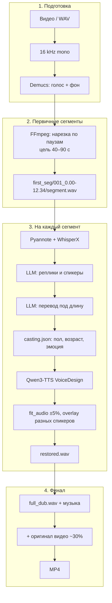

# SpeechLab

**Закадровый многоголосый дубляж видео** — перевод диалога, разметка спикеров, озвучка отдельным слоём и сборка финального ролика.

> Не lip-sync и не клонирование голоса актёра. Цель — понятный закадровый дубляж с профилем персонажа (пол, возраст, эмоция), а не копия оригинальной речи в кадре.

Спецификация продукта: [`PRD.md`](PRD.md)

---

## Пайплайн



| Этап | Инструменты |
|------|----------------|
| Аудио из видео | FFmpeg |
| Разделение голос / фон | [Demucs](https://github.com/facebookresearch/demucs) |
| Диаризация + ASR | [pyannote.audio](https://github.com/pyannote/pyannote-audio), [WhisperX](https://github.com/m-bain/whisperX) |
| Разметка и перевод | LLM (OpenAI-compatible API) |
| Биометрия / эмоция | wav2vec2 ([age/gender](https://huggingface.co/audeering/wav2vec2-large-robust-24-ft-age-gender), [emotion](https://huggingface.co/Dpngtm/wav2vec2-emotion-recognition)) |
| Озвучка | [Qwen3-TTS VoiceDesign](https://huggingface.co/Qwen/Qwen3-TTS-12Hz-1.7B-VoiceDesign) |
| Таймлайн | `fit_audio.py` (±5%, overlay только у разных спикеров) |

---

## Быстрый старт

### Требования

- Python 3.10+
- **FFmpeg** в `PATH`
- GPU рекомендуется (CUDA): WhisperX, Demucs, TTS
- Токен Hugging Face с доступом к `pyannote/speaker-diarization-community-1`
- Ключ LLM для разметки и перевода

### Установка

```bash
git clone https://github.com/HalooMo/Speech.git
cd Speech
python -m venv .venv
.venv\Scripts\activate          # Windows
# source .venv/bin/activate     # Linux / macOS
pip install -r requirements.txt
```

Скопируйте шаблон секретов и заполните **локально** (файл `config/.env` в git не попадает):

```bash
copy config\.env.example config\.env          # Windows
# cp config/.env.example config/.env          # Linux / macOS
```

| Переменная | Назначение |
|------------|------------|
| `HF_TOKEN` | Hugging Face (pyannote, модели) |
| `OPENAI_API_KEY` | LLM: сегментация + перевод |
| `OPENAI_BASE_URL` | URL OpenAI-compatible API (по умолчанию agentplatform) |
| `OPENAI_MODEL` | Модель LLM (по умолчанию `openai/gpt-5.5`) |

### Запуск

```bash
python main.py <имя_проекта> <путь_к_видео> <язык_источника> <язык_дубляжа>
```

Пример:

```bash
python main.py myfilm diolog.mp4 en ru
```

Результат:

```text
myfilm/
  vocals.wav
  demucs_stems/
  first_seg/
  full_dub.wav
  final_mux_audio.wav
  dub_output_path.txt
  first_seg/.../second_seg/casting.json
  myfilm_dubbed.mp4
```

Тест вторичной разметки (PRD п. 3.1–3.2) — в начале `test.py` задайте `WAV_PATH`:

```bash
python test.py
```

---

## Production API

HTTP-очередь дубляжа (одна задача GPU одновременно):

```bash
pip install -r requirements-server.txt
# config/.env: SPEECHLAB_ENV=production, SPEECHLAB_API_KEY=...
gunicorn -c deploy/gunicorn.conf.py wsgi:app
```

| Endpoint | Описание |
|----------|----------|
| `GET /health` | Статус сервиса |
| `GET /api/v1/cast-voices` | Встроенные голоса (Локи / Том Харди / Тор) |
| `POST /api/v1/dub` | Запуск (multipart `video` или JSON `video_path`) |
| `GET /api/v1/jobs/<id>` | Статус задачи |
| `GET /api/v1/jobs/<id>/download` | Скачать `{project}_dubbed.mp4` |

Опциональные поля `POST /api/v1/dub` (форма или JSON):

| Поле | Описание |
|------|----------|
| `voice_prompt` | Промпт VoiceDesign (алиас: `voice_design_template`) |
| `voice_gender` | `male` / `female` для всех реплик |
| `voice_age` | Возраст в годах, напр. `35` |
| `voice_design_temperature` | Температура TTS, 0–1 |
| `voice_design_by_key` | JSON: промпт по ключу `male_mature`, `female_teenager`, … |

Клонирование из аудио-сэмпла (опционально, `.mp3`/`.wav` до 10 МБ):

| Поле | Описание |
|------|----------|
| `voice_sample_male` / `voice_sample_female` | Файл-сэмпл для клонирования |
| `voice_sample_*_ages` | `child,teenager,mature,elderly` или JSON-массив; пусто = все 4 |
| `voice_sample_*_ref_text` | Точная транскрипт сэмпла (улучшает качество клона) |
| `voice_clone_samples` | JSON-массив расширенного формата (см. `for_client.txt`) |
| `cast_voice` | Встроенный пресет: `loki` / `tom_hardy` / `thor` (или «Локи» / «Том Харди» / «Тор») |
| `cast_mode` | `speakers` — раздать все 3 cast-голоса по спикерам |

Список пресетов: `GET /api/v1/cast-voices`. Слоты без сэмпла озвучиваются через VoiceDesign; с сэмплом — клонирование по референсу.

```bash
curl -X POST https://dub.example.com/api/v1/dub \
  -H "X-API-Key: YOUR_KEY" \
  -F project_name=demo \
  -F source_language=en \
  -F target_language=ru \
  -F voice_prompt="Warm {gender_hint} narrator, {lang}. {age_hint}, cinematic dubbing." \
  -F voice_gender=female \
  -F voice_age=32 \
  -F video=@diolog.mp4
```

С клонированием из аудио-сэмпла:

```bash
curl -X POST https://dub.example.com/api/v1/dub \
  -H "X-API-Key: YOUR_KEY" \
  -F project_name=demo \
  -F source_language=en \
  -F target_language=ru \
  -F voice_sample_male=@narrator.wav \
  -F voice_sample_male_ages=mature,elderly \
  -F voice_sample_male_ref_text="Exact words in the sample." \
  -F video=@diolog.mp4
```

Заголовок `X-API-Key` обязателен при `SPEECHLAB_ENV=production`. TLS — через nginx (`deploy/nginx.conf.example`), systemd — `deploy/speechlab.service`.

Проекты пишутся в `SPEECHLAB_PROJECTS_ROOT` (по умолчанию `data/projects/`), задачи — в `server/data/jobs/` (JSON на диске).

---

## Структура репозитория

```text
Speech/
├── main.py              # оркестратор E2E
├── test.py              # diarization → WhisperX → LLM → нарезка
├── prompt.py            # промпты LLM
├── config/
│   ├── env_config.py    # загрузка .env (config/.env)
│   └── .env.example
├── tools/
│   ├── llm.py           # клиент LLM API
│   ├── get_param.py     # пол, возраст, эмоция по WAV
│   ├── dubbing.py       # Qwen3-TTS
│   └── fit_audio.py     # подгонка длины и таймлайн
├── server/              # Flask API + subprocess worker
├── deploy/              # gunicorn, nginx, systemd
├── wsgi.py
├── PRD.md               # требования (источник истины)
└── .cursor/rules/
    └── main-rules.mdc
```

---

## Переменные окружения (опционально)

| Переменная | По умолчанию | Описание |
|------------|--------------|----------|
| `SPEECHLAB_MIN_PRIMARY_SEC` | `40` | Мин. длина первичного сегмента (сек) |
| `SPEECHLAB_MAX_PRIMARY_SEC` | `90` | Макс. длина первичного сегмента (сек) |
| `SPEECHLAB_ORIGINAL_AUDIO_RATIO` | `0.3` | Громкость оригинала видео в миксе (коэфф.) |
| `SPEECHLAB_DUB_VOLUME_PERCENT` | `100` | Громкость дубляжа относительно оригинала, % |
| `SPEECHLAB_WHISPER_MODEL` | `large-v3` | Модель WhisperX |
| `SPEECHLAB_COMPUTE_TYPE` | `float16` | Тип вычислений WhisperX на GPU |
| `SPEECHLAB_COMPUTE_TYPE` | `float32` | `float16` на GPU для экономии VRAM |
| `SPEECHLAB_MAX_WORDS_LLM` | `2800` | Лимит слов в одном запросе к LLM |

На Windows при ошибках VAD/k2 в WhisperX используйте `vad_method="silero"` (уже в test.py).

---

## Безопасность

- **Не коммитьте** `.env`, реальные `hf_...` и `sk-...` в код.
- Используйте `.env.example` только с плейсхолдерами.
- `__pycache__/` и `.pyc` в `.gitignore` — в bytecode могут остаться строки с ключами.
- Утёкший токен — сразу отозвать на [huggingface.co/settings/tokens](https://huggingface.co/settings/tokens).

---

## Соответствие PRD

Поведение кода следует [`PRD.md`](PRD.md): первичка 40–90 с, `casting.json`, Qwen3-TTS, финальный микс `дубляж×DUB% + оригинал×0.3`, путь к ролику в `dub_output_path.txt`. Склейка реплик — суммирование на таймлайне; наложение включается, если после fit ±5% реплика не влезает в слот **и** спикер сменился.

---

## Лицензия

Уточняется владельцем репозитория.
